# AI-Assistant

## Description

A Variational Autoencoder (VAE) is a type of generative model used in unsupervised learning, particularly in the domain of deep learning and neural networks. The primary purpose of a VAE is to model the underlying distribution of input data, enabling the generation of new samples that resemble the training data.

## Key Concepts:
**Encoder-Decoder Architecture:**
A VAE consists of an encoder and a decoder, forming an autoencoder structure. The encoder maps input data into a latent space, where each dimension represents a feature.

**Latent Space:**
The latent space is a lower-dimensional representation where data is assumed to follow a certain distribution (often Gaussian). It allows for efficient sampling and interpolation between data points.

**Variational Inference:**
VAEs use variational inference to estimate the posterior distribution of the latent space. This involves introducing a probabilistic element to the model, making it stochastic.

**Reparameterization Trick:**
To make backpropagation feasible in a stochastic model, the reparameterization trick is employed. It involves sampling from a simple distribution (e.g., Gaussian) and transforming the sample into the desired distribution.

 <h2>Workflow and Architecture</h2>
    

        The project involves three architectures. The first two architectures are Variational Autoencoders. The first VAE comprises of an encoder
        (three sequential conv2d layers) a bottleneck layer (two FCs for mean and variance calculation and the reparametrization layer), and the decoder 
        layer (three sequential convtranspose2d layer). The second architecture is the same as first, except that in the decoder layer we have three 
        upsample + conv layers. This architecture is called VAE-Variation. And the third architecture is of a standard autoencoder.
    

    <h2>Understanding Metrics</h2>
    

        The major inferences that can be drawn from observations are :  
        1. PSNR and LPIPS are the parameters that help us in understanding the performance of the model by comparing the generated image with it's ground truth value. A higher PSNR and a lower LPIPS indicates a good image. 
        2. The bottleneck layer disribution gives an indication of how easy it is to distinguish between classes. In other words, if a classifier is trained, how good or bad it'll perform. 
        3. The reconstructed image is the model output. 
    

    <h2>Observations</h2>

    <h3>Evaluation Metrics</h3>
    <h3>RESULTS FOR VAE</h3>
    <h4>MNIST DATA RESULTS</h4>
    <table>
        <tr>
            <th>Size of bottleneck layer</th>
            <th>PSNR</th>
            <th>LPIPS</th>
            <th>Reconstructed Image</th>
            <th>Bottleneck Layer distribution</th>
        </tr>
        <!-- Add rows for each image with corresponding PSNR and LPIPS scores -->
        <tr>
            <td>2</td>
            <td>13.392175427879028</td>
            <td>0.2470882730558514</td>
            <td>
                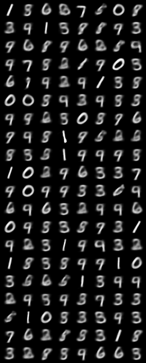
            </td>
            <td>
                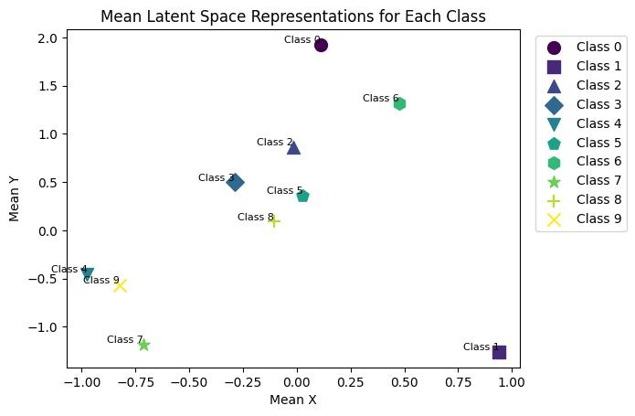
            </td>
        </tr>
        <tr>
            <td>10</td>
            <td>15.822724972980408</td>
            <td>0.1317140911705792</td>
            <td>
                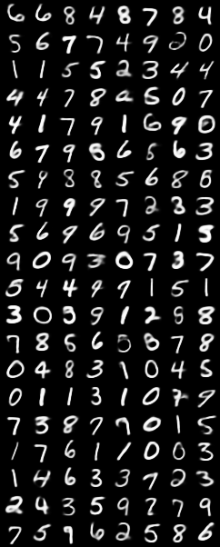
            </td>
            <td>
                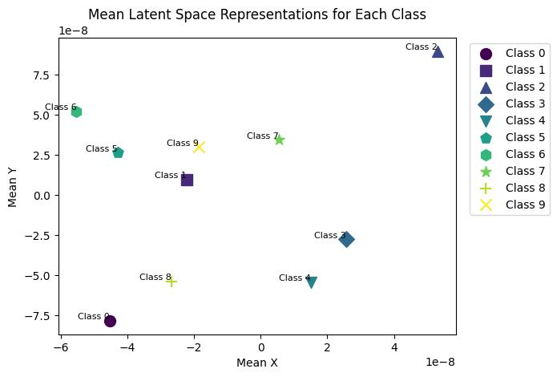
            </td>
        </tr>
    </table>
        <h4>CIFAR10 DATA RESULTS</h4>

    <table>
            <tr>
                <th>Size of bottleneck layer</th>
                <th>PSNR</th>
                <th>LPIPS</th>
                <th>Reconstructed Image</th>
                <th>Bottleneck Layer distribution</th>
            </tr>
            <!-- Add rows for each image with corresponding PSNR and LPIPS scores -->
            <tr>
                <td>64</td>
                <td>17.078560377700143</td>
                <td>0.40190513152629137</td>
                <td>
                    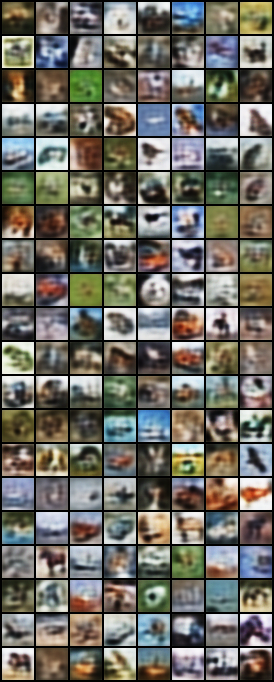
                </td>
                <td>
                    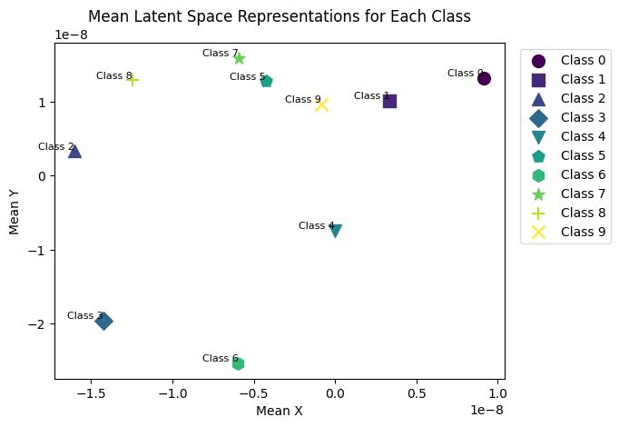
                </td>
            </tr>
            <tr>
                <td>128</td>
                <td>18.22797081576608</td>
                <td> 0.32085249945521355</td>
                <td>
                    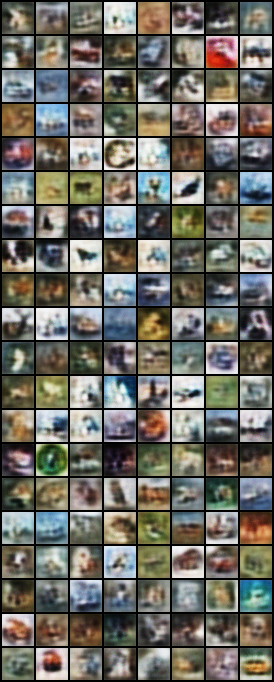
                </td>
                <td>
                    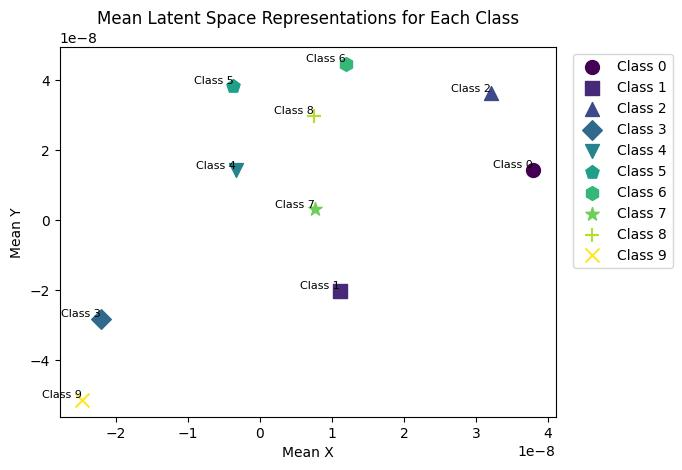
                </td>
            </tr>
            <tr>
                <td>256</td>
                <td>19.16980126602382</td>
                <td> 0.2600733716972172</td>
                <td>
                    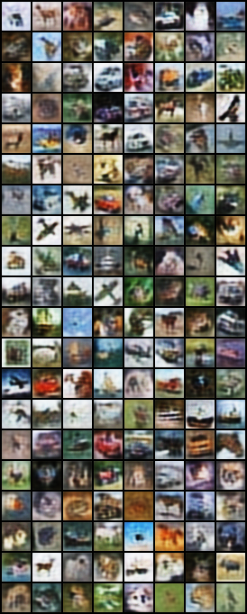
                </td>
                <td>
                    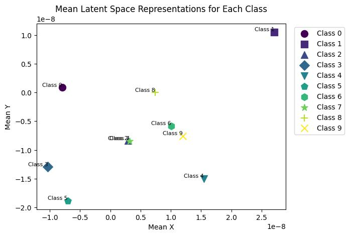
                </td>
            </tr>
    </table>
    <h3>RESULTS FOR VAE VARIATION</h3>
    <h4>MNIST DATASET RESULTS</h4>
    <table>
        <tr>
            <th>Size of bottleneck layer</th>
            <th>PSNR</th>
            <th>LPIPS</th>
            <th>Reconstructed Image</th>
            <th>Bottleneck Layer distribution</th>
        </tr>
        <!-- Add rows for each image with corresponding PSNR and LPIPS scores -->
        <tr>
            <td>2</td>
            <td>12.861776072285114</td>
            <td>0.2801305861212313</td>
            <td>
                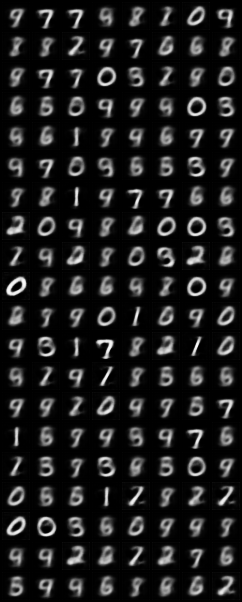
            </td>
            <td>
                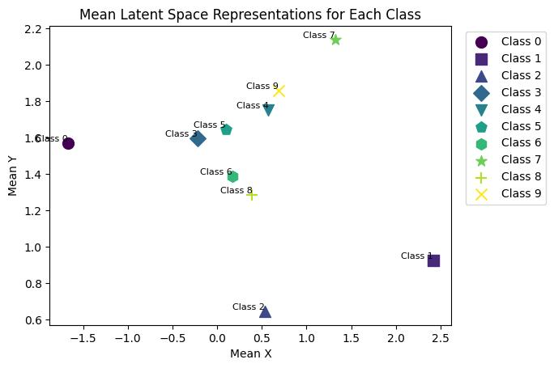
            </td>
        </tr>
        <tr>
            <td>10</td>
            <td>18.255316526550935</td>
            <td>0.15646151930559427</td>
            <td>
                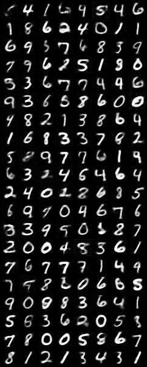
            </td>
            <td>
                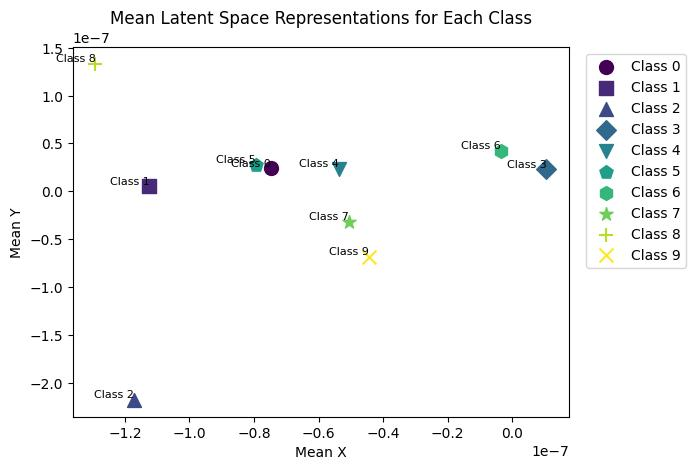
            </td>
        </tr>
    </table>
        <h4>CIFAR10 DATA RESULTS</h4>

    <table>
            <tr>
                <th>Size of bottleneck layer</th>
                <th>PSNR</th>
                <th>LPIPS</th>
                <th>Reconstructed Image</th>
                <th>Bottleneck Layer distribution</th>
            </tr>
            <!-- Add rows for each image with corresponding PSNR and LPIPS scores -->
            <tr>
                <td>64</td>
                <td>14.979190799345862</td>
                <td>0.4430371061898768</td>
                <td>
                    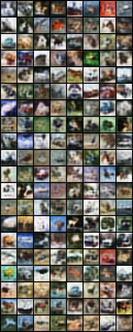
                </td>
                <td>
                    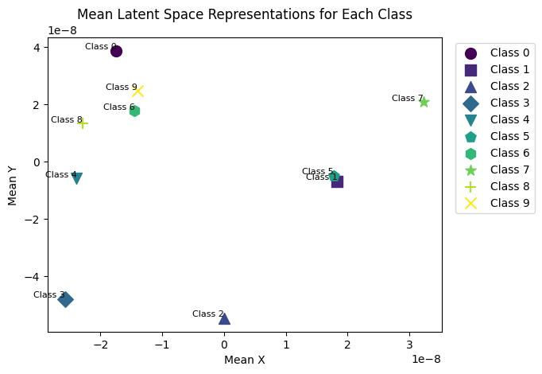
                </td>
            </tr>
            <tr>
                <td>128</td>
                <td>16.356243858018694</td>
                <td>0.3574161999858916</td>
                <td>
                    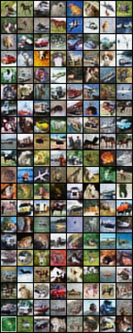
                </td>
                <td>
                    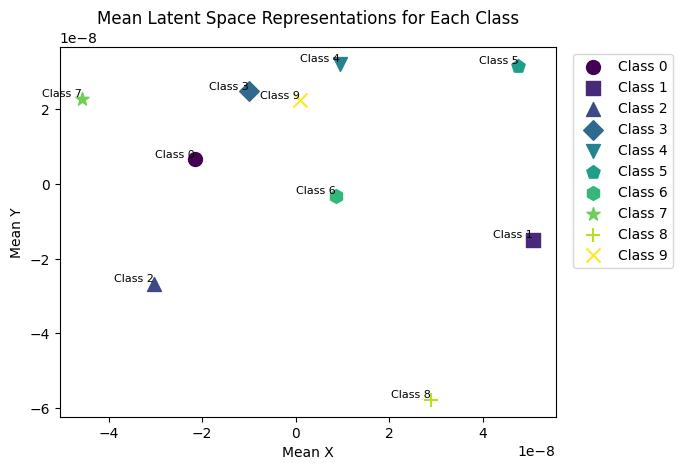
                </td>
            </tr>
            <tr>
                <td>256</td>
                <td>16.965382100831732</td>
                <td>0.3165968810208142</td>
                <td>
                    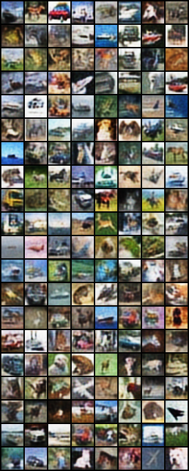
                </td>
                <td>
                    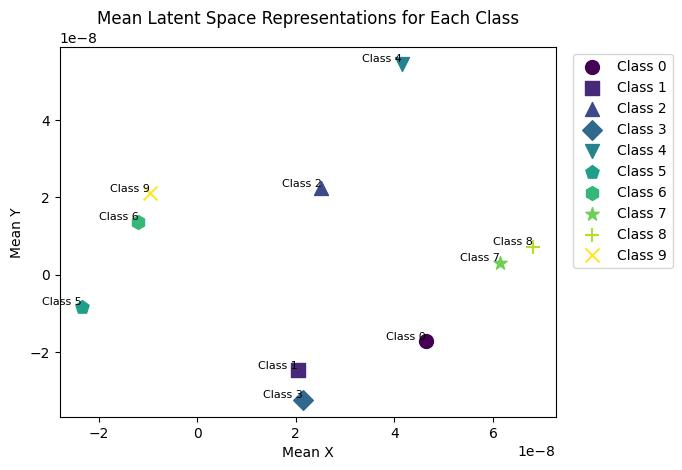
                </td>
            </tr>
    </table>
    <h2>Inference and Conclusions</h2>
    

        The major conclusions that can be drawn from observations are :  
        1. Increasing the bottleneck layer size imporves performance.  
        2. Concluding anything on classification accuracy is not possible. 
        3. The image quality gets better with increasing bottleneck layer size.  
    

